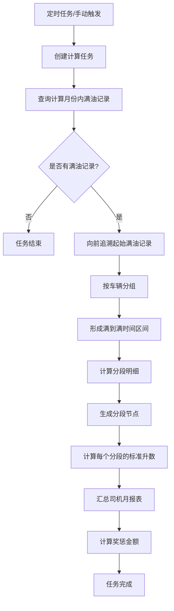
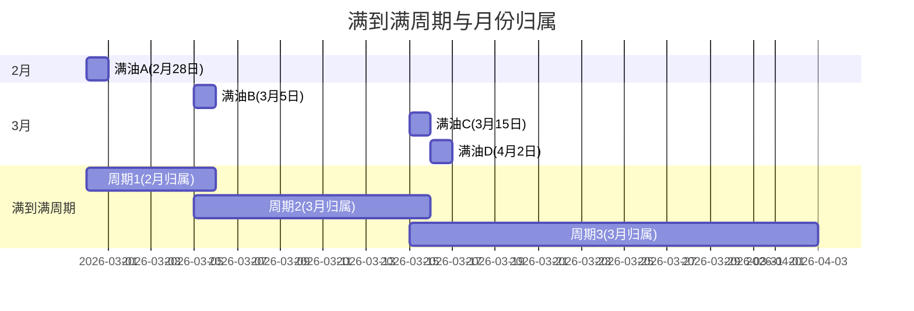

# 财运通 - 油耗分析月报表计算逻辑（分段定油耗模式）

> 文档生成时间：2026-03-20  
> 适用场景：公司管理 → 标准管理 → 定油耗标准 → 模式设置 = 分段定油耗

---

## 一、报表数据来源

### 1. 基础数据表

| 数据表 | 说明 |
|-------|-----|
| `bs_oil_segment_detail` | 分段明细表：根据影响因素（空重驶、国道高速等）将行驶时间分段 |
| `bs_oil_segment_month_driver` | 司机月报表：按司机+月份汇总 |
| `bs_oil_segment_oil_full` | 满到满汇总表：按车辆+满到满周期汇总 |
| `common_approval` | 在途费用表：司机填写的加油记录 |

### 2. 数据关系

```
bs_oil_segment_task (计算任务)
    └── bs_oil_segment_detail (分段明细)
            ├── month (归属月份)
            └── 关联在途费用

bs_oil_segment_month_driver (司机月报表)
    └── month (汇总该月份的分段明细)

bs_oil_segment_oil_full (满到满汇总)
    └── full_time_start → full_time_end (满到满周期)
```

---

## 二、核心计算公式

### 1. 标准升数（oil_consumption）

```
标准升数 = Σ 分段明细中的标准升数

每个分段的标准升数 = 里程 × 标准百公里油耗 ÷ 100
```

**取值来源**：`BsOilSegmentDetail.oilConsumption`

**配置位置**：公司管理 → 标准管理 → 定油耗标准

---

### 2. GPS里程数（mileage）

```
GPS里程数 = Σ 分段明细中的里程
```

**说明**：受"里程与客户设备一致"配置控制

| 配置值 | 里程类型 |
|-------|---------|
| `mileage_customer_device = false`（默认） | GPS里程 |
| `mileage_customer_device = true` | 码表里程（与客户设备一致） |

**配置位置**：系统设置 → 任务设置 → 任务操作设置 → "里程与客户设备一致"

---

### 3. 实际升数/在途加油量（full_oil_onway）

```
实际升数 = Σ 在途费用中填写的加油量(升)
```

**取值来源**：在途费用中费用类型为"在途油费"（`fee_type = ON_WAY_OIL`）的记录

---

### 4. 平均油价（oil_price_avg）

```
平均油价 = 油费合计 ÷ 实际升数合计
```

**取值来源**：在途费用中的油费金额（`amount`）和加油量（`quantity`）

---

### 5. 升数差额

```
升数差额 = 标准升数 - 实际升数
```

---

### 6. 油耗奖励金额（oil_award_amount）

```
当 标准升数 > 实际升数 时：
油耗奖励金额 = (标准升数 - 实际升数) × 油价 × 奖励系数
```

**配置来源**：公司管理 → 标准管理 → 定油耗标准 → 油耗奖惩设置

---

### 7. 油耗惩罚金额（oil_punish_amount）

```
当 标准升数 < 实际升数 时：
油耗惩罚金额 = (实际升数 - 标准升数) × 油价 × 惩罚系数
```

**配置来源**：公司管理 → 标准管理 → 定油耗标准 → 油耗奖惩设置

---

## 三、分段明细生成逻辑

### 1. 分段依据

根据以下影响因素对行驶时间进行分段：

| 影响因素 | 说明 |
|---------|-----|
| 空重驶 | 空驶/重驶状态变化 |
| 国道高速 | 道路类型变化 |

### 2. 分段流程

```
1. 从满到满的时间范围内，获取所有运单和在途费用
2. 根据影响因素生成分段节点（时间点）
3. 按时间升序排序分段节点
4. 每个分段根据车辆的标准百公里油耗配置计算标准升数
```

### 3. 标准百公里油耗配置

**配置位置**：公司管理 → 标准管理 → 定油耗标准

**配置维度**：
- 按车辆类型配置
- 按空重驶配置
- 按国道高速配置

---

## 四、计算时间周期逻辑

### 1. 月份计算周期

#### 默认计算月份
```java
// 计算上个月（T+1计算）
LocalDate yesterday = LocalDate.now().minusDays(1);
return Integer.valueOf(yesterday.format(DateTimeFormatter.ofPattern("yyyyMM")));
```

#### 满油记录查询时间范围
```
查询条件：happen_time >= 月初 AND happen_time < 下月初
费用类型：在途油费
满油标识：tank_full = true
```

---

### 2. 满到满时间周期

#### 计算逻辑
```
满到满周期 = 上一次满油时间 → 本次满油时间
```

#### 时间范围构建步骤
1. 查询计算月份内的满油记录
2. 向前追溯N个月（配置控制）获取起始满油记录
3. 按车辆分组，按时间升序排序
4. 形成满到满时间区间

#### 向前追溯逻辑
```
配置项：oilSegmentConfig.getStartFullRecordPreMaxMonth()
作用：如果本月第一笔满油之前没有起始满油，向前追溯N个月查找
```

**示例**：
| 场景 | 说明 |
|-----|-----|
| 计算月份 | 2026年3月 |
| 第一笔满油 | 3月15日 |
| 需要起始满油 | 3月之前的最近一次满油（如2月28日） |
| 向前追溯 | 如果2月没有，继续向前查找 |

---

### 3. 分段明细归属月份

#### 归属规则
```
分段明细归属月份 = 满到满周期的开始时间（本次满油时间）所在月份
```

**示例**：

| 满到满周期 | 分段明细归属月份 |
|-----------|----------------|
| 2月28日 → 3月5日 | 2月 |
| 3月5日 → 3月15日 | 3月 |
| 3月15日 → 4月2日 | 3月 |

---

### 4. 月报表汇总逻辑

#### 司机月报表
```
司机月报表数据 = Σ 该月所有分段明细（month = 计算月份）
```

#### 满到满汇总表
```
满到满汇总数据 = 该满到满周期内所有分段明细汇总
```

**说明**：满到满汇总表可能跨月（如2月28日→3月5日），但分段明细归属到各自月份

---

## 五、计算触发方式

### 1. 定时任务

```java
// 触发条件：开启分段定油耗的集团
TR groupSettingSetsR = remoteSettingService.groupSettingSets("oil_consumption_pattern_3_gid");
```

### 2. 手动触发

通过系统设置手动重新计算指定月份

---

## 六、代码位置

| 功能 | 文件路径 |
|-----|---------|
| 月报表计算 | `BsOilSegmentMonthDriverService.java:140-320` |
| 分段明细计算 | `VehicleOilSegmentTaskAsyncMsgService.java` |
| 标准升数计算 | `BsOilSegmentDetailService.java:222` |
| 满到满汇总 | `BsOilSegmentOilFullService.java` |
| 满油记录查询 | `Approval4OilSegmentServiceImpl.java` |
| 里程类型配置 | `GPSMileageServiceImpl.java:263` |

---

## 七、数据表字段说明

### 1. bs_oil_segment_detail（分段明细表）

| 字段 | 类型 | 说明 |
|-----|-----|-----|
| id | Long | 主键ID |
| group_id | Integer | 集团ID |
| task_id | Long | 任务ID |
| month | Integer | 满油计算月份（归属月份），格式yyyyMM |
| dr_id | Integer | 司机ID |
| tr_id | Integer | 车辆ID |
| start_time | LocalDateTime | GPS里程开始时间 |
| end_time | LocalDateTime | GPS里程结束时间 |
| mileage | BigDecimal | GPS里程（受配置控制） |
| oil_standard | BigDecimal | 标准百公里油耗 |
| oil_consumption | BigDecimal | 标准升数 |
| effect_factor | String | 影响因素：空重驶、国道高速 |
| approval_ids | String | 关联的在途费用ID列表 |

### 2. bs_oil_segment_month_driver（司机月报表）

| 字段 | 类型 | 说明 |
|-----|-----|-----|
| id | Long | 主键ID |
| group_id | Integer | 集团ID |
| task_id | Long | 任务ID |
| month | Integer | 计算月份，格式yyyyMM |
| dr_id | Integer | 司机ID |
| dr_name | String | 司机姓名 |
| oil_consumption | BigDecimal | 标准油耗量（标准升数） |
| mileage | BigDecimal | GPS里程数 |
| full_oil_onway | BigDecimal | 在途加油量（实际升数） |
| oil_price_avg | BigDecimal | 平均油价 |
| oil_award_amount | BigDecimal | 油耗奖励金额 |
| oil_punish_amount | BigDecimal | 油耗惩罚金额 |
| oil_award_coefficient | BigDecimal | 油耗奖励系数 |
| oil_punish_coefficient | BigDecimal | 油耗惩罚系数 |

### 3. bs_oil_segment_oil_full（满到满汇总表）

| 字段 | 类型 | 说明 |
|-----|-----|-----|
| id | Long | 主键ID |
| group_id | Integer | 集团ID |
| task_id | Long | 任务ID |
| month | Integer | 满油计算月份，格式yyyyMM |
| tr_id | Integer | 车辆ID |
| tr_num | String | 车牌号 |
| full_time_start | LocalDateTime | 满到满开始时间 |
| full_time_end | LocalDateTime | 满到满结束时间 |
| mileage | BigDecimal | GPS里程 |
| oil_consumption | BigDecimal | 标准升数 |
| full_oil_onway | BigDecimal | 在途加油量（实际升数） |
| segment_info | String | 分段明细汇总信息 |

---

## 八、流程图

### 油耗分析月报表计算流程



### 满到满周期示意图



---

## 九、注意事项

1. **满油记录要求**：必须标记为满油（`tank_full = true`）的在途油费记录才会参与计算
2. **里程类型配置**：根据"里程与客户设备一致"配置决定使用GPS里程还是码表里程
3. **跨月处理**：满到满周期可能跨月，分段明细按开始时间归属到对应月份
4. **油价来源**：平均油价从在途费用中计算，也可配置使用固定油价
5. **奖惩计算**：只有标准升数和实际升数有差异时才计算奖惩金额

---

## 十、相关配置

### 1. 系统设置

| 配置项 | 配置位置 | 说明 |
|-------|---------|-----|
| 里程与客户设备一致 | 系统设置 → 任务设置 → 任务操作设置 | 控制使用GPS里程或码表里程 |
| 定油耗标准模式 | 公司管理 → 标准管理 → 定油耗标准 | 必须设置为"分段定油耗" |

### 2. 油耗标准配置

| 配置项 | 说明 |
|-------|-----|
| 标准百公里油耗 | 按车辆类型、空重驶、国道高速配置 |
| 油耗奖励系数 | 标准升数 > 实际升数时的奖励比例 |
| 油耗惩罚系数 | 标准升数 < 实际升数时的惩罚比例 |
| 油价类型 | 平均油价/固定油价 |

---

*文档结束*
