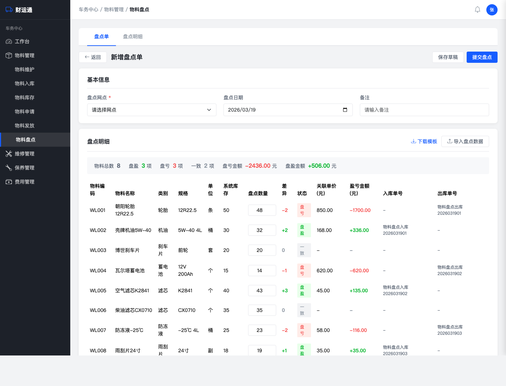
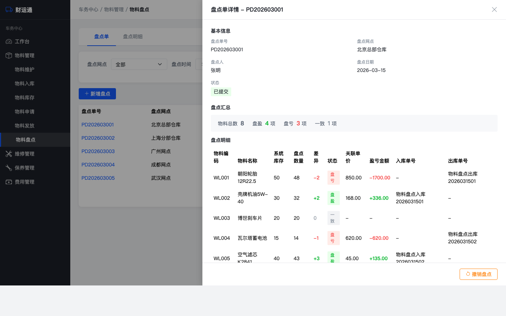
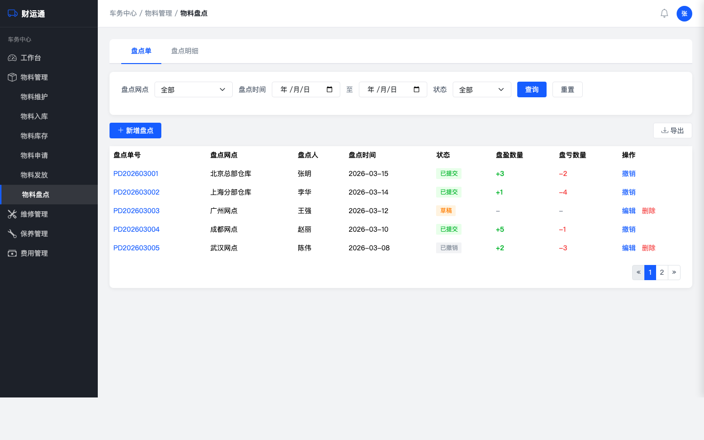
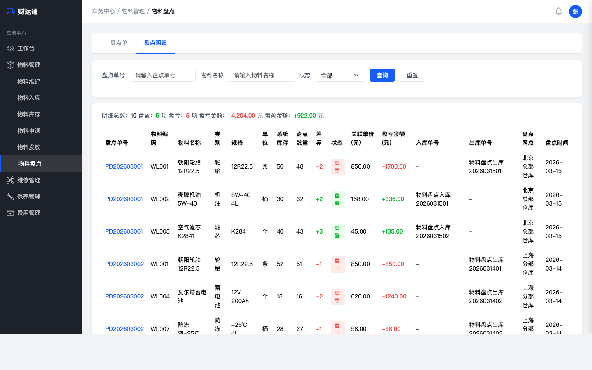

# 物料盘点 产品需求文档（PRD）

## 文档信息

| 项目 | 内容 |
|------|------|
| 文档版本 | v1.0 |
| 创建日期 | 2026-03-19 |
| 状态 | 草稿 |
| 所属系统 | 财运通 - 车务中心 |
| 所属模块 | 物料管理 - 库存管理 |
| 知识库参考 | `knowledge-base/物料管理/物料管理知识.html` |
| 原型文件 | `Owned fleet/物料管理/prototypes/物料盘点/index.html` |

---

## 1. 概述

### 1.1 项目背景

物料管理当前业务流程为：物料维护 → 物料入库 → 物料申请 → 物料发放 → 物料库存。在实际运营中，物料会因丢失、破损、计量误差等原因导致系统记录的可用库存与仓库实际数量产生偏差，但系统目前没有修正机制。

客户需要在完成实物盘点后，将盘点结果录入系统，由系统自动计算差异并调整库存数量，同时关联入库单实现金额核算。

### 1.2 项目目标

- 支持按网点维度创建盘点单，录入实际盘点数量，系统自动计算盘盈/盘亏
- 盘亏按FIFO关联入库单扣减并计算金额，盘盈自动生成入库单
- 支持撤销已提交的盘点单，库存和入库单联动恢复
- 通过功能权限和网点层级控制操作范围

### 1.3 项目范围

**包含（In Scope）**：
- 盘点单的创建、录入、提交、撤销、重新编辑全流程
- 盘亏关联入库单（FIFO扣减）及金额计算
- 盘盈自动生成入库单（来源：盘点），盘亏自动生成出库记录
- 撤销时入库单/出库单联动恢复/作废
- 盘点差异报表导出
- 按网点维度盘点，网点层级权限控制
- 盘点明细汇总查看

**不包含（Out of Scope）**：
- 移动端盘点
- 条码/RFID扫码盘点
- 审批流程（通过功能权限控制）
- 盘点期间冻结机制
- 差异阈值预警

### 1.4 术语定义

| 术语 | 定义 |
|------|------|
| 盘点单 | 一次库存盘点的记录单据，包含盘点网点、盘点人、盘点日期及各物料的盘点明细 |
| 盘盈 | 实际盘点数量 > 系统库存数量，物料多出 |
| 盘亏 | 实际盘点数量 < 系统库存数量，物料短缺 |
| FIFO | 先进先出，盘亏扣减时从最早创建且仍有余量的入库单开始扣 |
| 盘点入库单 | 盘盈时系统自动生成的入库单，来源标记为「盘点」 |
| 盘点出库单 | 盘亏时系统自动生成的出库记录 |

---

## 2. 用户分析

### 2.1 目标用户

| 角色 | 描述 | 核心诉求 |
|------|------|----------|
| 仓管员 | 负责仓库物料的日常管理和盘点操作 | 快速录入盘点数量，系统自动算差异和金额 |
| 车队管理员 | 管理各网点车队运营，关注物料损耗 | 查看各网点盘点结果，掌握损耗情况 |
| 财务人员 | 负责物料费用核算 | 获取盘盈/盘亏金额数据，导出报表 |

### 2.2 用户故事（摘要）

| # | 用户故事 | 优先级 | 故事点 |
|---|----------|--------|--------|
| S1 | 仓管员选择网点创建盘点单，系统自动带出物料及库存 | P0 | 5 |
| S2 | 仓管员逐项录入盘点数量，系统自动计算差异 | P0 | 3 |
| S3 | 仓管员通过Excel批量导入盘点结果 | P1 | 5 |
| S4 | 提交盘点单时校验库存、关联入库单、计算金额 | P0 | 8 |
| S5 | 查看盘点单列表，按网点/时间/状态筛选 | P1 | 3 |
| S6 | 财务人员导出盘点差异报表 | P2 | 2 |
| S7 | 车队管理员查看盘点操作日志 | P2 | 2 |
| S8 | 撤销已提交的盘点单，库存和入库单联动恢复 | P0 | 8 |
| S9 | 重新编辑已撤销的盘点单并再次提交 | P1 | 3 |

完整用户故事详见：`Owned fleet/物料管理/物料盘点-用户故事.md`

---

## 3. 需求详述

### 3.1 功能清单

| 编号 | 功能名称 | 优先级 | 描述 |
|------|----------|--------|------|
| F001 | 创建盘点单 | P0 | 选择网点，自动加载物料及库存 |
| F002 | 录入盘点数量 | P0 | 逐项填写盘点数量，自动计算差异/金额/单号 |
| F003 | 提交盘点单 | P0 | 校验库存、关联入库单(FIFO)、生成出入库单、更新库存 |
| F004 | 撤销盘点单 | P0 | 恢复库存、恢复/作废关联的出入库单 |
| F005 | 重新编辑 | P1 | 已撤销的盘点单可重新编辑提交 |
| F006 | 盘点单列表 | P1 | 列表展示、筛选、盘点单号链接查看详情 |
| F007 | 盘点明细汇总 | P1 | 跨盘点单的全部明细汇总查看 |
| F008 | 批量导入 | P1 | Excel导入盘点数据 |
| F009 | 导出报表 | P2 | 导出盘点差异报表 |
| F010 | 操作日志 | P2 | 记录盘点相关的库存调整日志 |

### 3.2 功能详细说明

#### F001 创建盘点单

- 入口：物料盘点页面 →「新增盘点」按钮
- 选择盘点网点（必填），仅显示当前用户本级和下级网点
- 选择网点后，系统自动加载该网点下所有启用状态的物料，显示：物料编码、名称、类别、规格、单位、系统当前库存
- 盘点日期默认当天，可修改
- 备注选填

**交互说明**：详见原型文件



#### F002 录入盘点数量

- 在盘点明细表格中，每项物料的「盘点数量」列为可编辑输入框
- 输入盘点数量后，系统自动计算：
  - 差异 = 盘点数量 - 系统库存
  - 状态：正数→盘盈（绿色），负数→盘亏（红色），零→一致（灰色）
  - 关联单价：取FIFO最早入库单价（盘亏）或最近入库单价（盘盈）
  - 盈亏金额 = 差异 × 关联单价
  - 入库单号：盘盈项自动生成，格式 `物料盘点入库+YYYYMMDD+两位序号`
  - 出库单号：盘亏项自动生成，格式 `物料盘点出库+YYYYMMDD+两位序号`
- 盘点数量仅允许非负整数
- 支持Tab键逐行跳转
- 顶部汇总条实时更新：物料总数、盘盈项数、盘亏项数、一致项数、盘亏金额、盘盈金额

**交互说明**：详见原型文件


#### F003 提交盘点单

**提交前校验**：
1. 所有盘亏项：当前系统库存（实时查询）≥ 减少数量，否则拦截
2. 校验不通过时，提示具体物料名称、系统库存、盘点数量、差额

**提交确认弹窗**：
- 展示盘点汇总：网点、物料总数、盘盈/盘亏项数、盘亏金额、盘盈金额
- 用户确认后执行提交

**提交执行（同一事务）**：
1. 更新物料的当前库存和可用库存
2. 盘亏项：按FIFO从最早且有余量的入库单开始扣减，记录每条入库单的扣减数量和单价；自动生成出库记录
3. 盘盈项：自动生成入库单（来源：盘点，单价取最近入库单价）
4. 盘点单状态变为「已提交」
5. 记录操作日志

**业务规则**：
- **盘亏FIFO扣减**：从最早创建且有余量的入库单开始扣减，单条不够继续扣下一条，直至扣完
- **盘盈入库单价**：取该物料最近一次入库单价
- **实时库存校验**：提交时实时查询当前库存，防止并发操作导致数据不一致

**交互说明**：详见原型文件


#### F004 撤销盘点单

- 入口：盘点单列表操作列「撤销」按钮 / 盘点详情抽屉「撤销盘点」按钮
- 仅「已提交」状态可撤销

**撤销确认弹窗**：
- 警告提示：撤销后库存将恢复，盘盈入库单将作废，盘亏出库单将作废
- 提示：如果撤销期间相关物料已被领用导致库存不足，撤销将失败

**撤销执行（同一事务）**：
1. 校验库存可恢复性（盘盈物料当前库存 ≥ 盘盈数量）
2. 盘亏项：恢复对应入库单的剩余库存，作废出库记录
3. 盘盈项：作废对应的盘点入库单，扣减库存
4. 物料库存恢复至盘点前状态
5. 盘点单状态变为「已撤销」
6. 记录操作日志

**业务规则**：
- **撤销校验**：实时查询当前库存，确保盘盈物料库存足够扣回
- **入库单恢复**：盘亏项按提交时记录的扣减明细反向恢复入库单余量
- **入库单作废**：盘盈项作废对应的盘点入库单（来源为「盘点」）

**交互说明**：详见原型文件



#### F005 重新编辑

- 「已撤销」状态的盘点单可点击「编辑」
- 加载原有盘点数据，系统库存刷新为当前最新值
- 修改后可重新提交，提交逻辑与F003一致

**交互说明**：详见原型文件

#### F006 盘点单列表

- 页面Tab「盘点单」下展示
- 搜索条件：盘点网点、盘点时间范围、状态
- 表格列：盘点单号（蓝色链接）、盘点网点、盘点人、盘点时间、状态、盘盈数量、盘亏数量、操作
- 盘点单号点击打开右侧抽屉弹窗（60%浏览器宽度）查看详情
- 操作列：
  - 已提交：撤销
  - 草稿/已撤销：编辑 | 删除
- 底部分页

**原型截图**：



#### F007 盘点明细汇总

- 页面Tab「盘点明细」下展示
- 跨盘点单的全部明细记录汇总
- 顶部汇总条：明细总数、盘盈项数、盘亏项数、盘亏金额、盘盈金额
- 搜索条件：盘点单号、物料名称、状态（盘盈/盘亏/一致）
- 表格列：盘点单号（蓝色链接）、物料编码、物料名称、类别、规格、单位、系统库存、盘点数量、差异、状态、关联单价、盈亏金额、入库单号、出库单号、盘点网点、盘点时间
- 盘点单号点击同样打开抽屉弹窗

**交互说明**：详见原型文件



#### F008 批量导入

- 提供Excel模板下载（物料编码、物料名称、盘点数量）
- 导入校验：物料编码是否存在于当前网点
- 导入成功后自动填充盘点数量并计算差异
- 导入失败返回错误明细（行号+原因）

**交互说明**：详见原型文件

#### F009 导出报表

- 支持按时间范围、网点筛选后导出
- 导出内容：物料编码、名称、类别、规格、单位、系统库存、盘点数量、差异、关联单价、盈亏金额、入库单号、出库单号、盘点时间、盘点网点、盘点人
- 格式：Excel

**交互说明**：详见原型文件

#### F010 操作日志

- 盘点提交/撤销后自动记录日志（操作人、操作时间、盘点单号、调整明细）
- 在物料库存明细中可查看「盘点调整」类型的出入库记录

**交互说明**：详见原型文件

### 3.3 入库/出库单号规则

| 类型 | 格式 | 示例 |
|------|------|------|
| 盘点入库单 | 物料盘点入库+YYYYMMDD+两位序号 | 物料盘点入库2026031501 |
| 盘点出库单 | 物料盘点出库+YYYYMMDD+两位序号 | 物料盘点出库2026031501 |

- 序号按同一盘点单内盘盈/盘亏项分别从01开始递增
- 入库单来源字段标记为「盘点」，关联盘点单号

### 3.4 状态流转

```
草稿 ──提交──→ 已提交 ──撤销──→ 已撤销
 ↑                                  │
 └──────── 重新编辑提交 ←───────────┘
```

| 状态 | 可执行操作 |
|------|-----------|
| 草稿 | 编辑、删除、提交 |
| 已提交 | 查看、撤销 |
| 已撤销 | 编辑（重新提交）、删除 |

### 3.5 权限控制

| 权限项 | 说明 |
|--------|------|
| 功能权限 | 仅拥有「物料盘点」功能权限的用户可见和操作 |
| 网点权限 | 用户只能对本级网点或下级网点发起盘点 |

### 3.6 非功能需求

- **数据一致性**：库存调整、入库单/出库单操作必须在同一事务中完成
- **操作日志**：所有库存调整需记录操作日志，可追溯
- **并发控制**：提交/撤销时实时校验当前库存，防止并发操作导致数据不一致

---

## 4. 交互设计

### 4.1 页面结构

```
物料盘点页面
├── Tab：盘点单（默认）
│   ├── 视图1：盘点单列表（搜索+表格+分页）
│   └── 视图2：创建/编辑盘点单（基本信息+盘点明细表格）
├── Tab：盘点明细（汇总统计+搜索+表格+分页）
├── 抽屉弹窗：盘点单详情（60%浏览器宽度，右侧滑入）
├── Modal：提交确认弹窗
└── Modal：撤销确认弹窗
```

### 4.2 界面说明

原型文件：`Owned fleet/物料管理/prototypes/物料盘点/index.html`

主要交互：
1. 盘点单号为蓝色链接，点击打开右侧抽屉弹窗查看详情
2. 抽屉弹窗宽度为浏览器60%，从右侧滑入，带遮罩
3. 盘点数量输入框修改后实时计算差异、金额、入库/出库单号
4. 表格内容超出容器时显示横向滚动条

**原型截图**：


盘点单列表页面，展示所有盘点单的汇总信息，支持筛选和查看详情。


创建/编辑盘点单页面，包含盘点明细表格和顶部汇总条，支持录入盘点数量并实时计算差异。


盘点明细Tab页面，跨盘点单汇总展示所有盘点明细记录。


盘点详情抽屉弹窗，从右侧滑入，展示盘点单的完整信息，支持撤销操作。

---

## 5. 数据需求

### 5.1 盘点单主表

| 字段名 | 类型 | 必填 | 说明 |
|--------|------|------|------|
| id | bigint | 是 | 主键 |
| order_no | varchar(20) | 是 | 盘点单号，格式 PD+YYYYMM+序号 |
| site_id | bigint | 是 | 盘点网点ID |
| site_name | varchar(100) | 是 | 盘点网点名称 |
| check_date | date | 是 | 盘点日期 |
| check_user_id | bigint | 是 | 盘点人ID |
| check_user_name | varchar(50) | 是 | 盘点人姓名 |
| status | tinyint | 是 | 状态：0草稿/1已提交/2已撤销 |
| remark | varchar(500) | 否 | 备注 |
| created_at | datetime | 是 | 创建时间 |
| updated_at | datetime | 是 | 更新时间 |

### 5.2 盘点单明细表

| 字段名 | 类型 | 必填 | 说明 |
|--------|------|------|------|
| id | bigint | 是 | 主键 |
| order_id | bigint | 是 | 关联盘点单ID |
| material_code | varchar(20) | 是 | 物料编码 |
| material_name | varchar(100) | 是 | 物料名称 |
| category | varchar(50) | 是 | 物料类别 |
| spec | varchar(100) | 否 | 规格 |
| unit | varchar(20) | 是 | 单位 |
| system_stock | int | 是 | 盘点时系统库存（快照） |
| check_count | int | 否 | 实际盘点数量 |
| diff | int | 否 | 差异（check_count - system_stock） |
| status | tinyint | 否 | 0一致/1盘盈/2盘亏 |
| unit_price | decimal(10,2) | 否 | 关联单价 |
| amount | decimal(12,2) | 否 | 盈亏金额 |
| in_order_no | varchar(30) | 否 | 盘点入库单号（盘盈时） |
| out_order_no | varchar(30) | 否 | 盘点出库单号（盘亏时） |

### 5.3 盘亏扣减明细表

| 字段名 | 类型 | 必填 | 说明 |
|--------|------|------|------|
| id | bigint | 是 | 主键 |
| check_detail_id | bigint | 是 | 关联盘点明细ID |
| in_stock_id | bigint | 是 | 关联入库单ID |
| deduct_count | int | 是 | 扣减数量 |
| unit_price | decimal(10,2) | 是 | 该入库单的单价 |

用于撤销时精确恢复入库单余量。

---

## 6. 风险评估

| 风险项 | 影响程度 | 应对策略 |
|--------|----------|----------|
| 撤销时相关物料已被领用导致库存不足 | 高 | 撤销时实时校验库存可恢复性，不满足则拦截并提示具体物料 |
| 提交时库存已被其他操作变更 | 高 | 提交时实时校验当前库存，不满足则拦截并提示 |
| 盘点数量录入错误 | 中 | 差异列醒目标记，提交前展示汇总确认弹窗 |
| 大量物料盘点录入效率低 | 中 | 支持Excel批量导入 |
| FIFO扣减跨多条入库单时逻辑复杂 | 中 | 记录扣减明细表，确保撤销时可精确恢复 |

---

## 6. 接口需求

本PRD为功能级需求文档，详细接口设计将在技术设计阶段完成。主要接口包括：

- 创建/编辑盘点单接口
- 提交盘点单接口（含库存校验、FIFO扣减、入库单/出库单生成）
- 撤销盘点单接口（含库存恢复、入库单/出库单联动）
- 盘点单列表查询接口
- 盘点明细汇总查询接口
- 批量导入接口
- 导出报表接口

---

## 7. 验收标准

- [ ] 可创建盘点单，选择网点后自动带出该网点物料及系统库存数量
- [ ] 可逐项录入实际盘点数量，系统自动计算差异、金额、入库/出库单号
- [ ] 提交时校验：库存减少项的当前库存 ≥ 减少数量，否则拦截提示
- [ ] 提交后系统库存自动更新，物料库存列表中数值正确
- [ ] 盘亏按FIFO关联入库单扣减，自动生成出库单，盘亏金额 = 扣减数量 × 对应入库单价
- [ ] 盘盈自动生成来源为「盘点」的入库单，单价取最近一次入库单价
- [ ] 入库单号格式：物料盘点入库+YYYYMMDD+序号；出库单号格式：物料盘点出库+YYYYMMDD+序号
- [ ] 盘点单列表Tab支持按网点、状态、时间筛选
- [ ] 盘点明细Tab展示跨单汇总，顶部有统计条
- [ ] 盘点单号为可点击链接，打开抽屉弹窗查看详情
- [ ] 支持导出盘点差异报表
- [ ] 已提交的盘点单可撤销，撤销后库存恢复，入库单/出库单联动恢复/作废
- [ ] 撤销时校验：若相关物料已被领用导致库存不足，撤销被拦截并提示
- [ ] 已撤销的盘点单可重新编辑并再次提交
- [ ] 仅有「物料盘点」权限的用户可操作，网点权限限制生效
- [ ] 所有库存调整操作有日志记录

---

## 8. 附录

### 8.1 参考文档

| 文档 | 路径 |
|------|------|
| 需求分析报告 | `Owned fleet/物料管理/物料盘点-需求分析.md` |
| 用户故事 | `Owned fleet/物料管理/物料盘点-用户故事.md` |
| 原型文件 | `Owned fleet/物料管理/prototypes/物料盘点/index.html` |
| 物料管理知识库 | `knowledge-base/物料管理/物料管理知识.html` |

### 8.2 原型文件

完整交互原型请打开以下文件在浏览器中体验：

`Owned fleet/物料管理/prototypes/物料盘点/index.html`

原型截图：
- 盘点单列表：`prototypes/物料盘点/screenshots/01-盘点单列表.png`

### 8.3 变更记录

| 版本 | 日期 | 修改内容 |
|------|------|----------|
| v1.0 | 2026-03-19 | 初始版本 |

---

## 9. 问题与答疑

| 问题 | 提出人 | 提出日期 | 回答 | 回答人 | 回答日期 |
|------|--------|----------|------|--------|----------|
|      |        |          |      |        |          |
